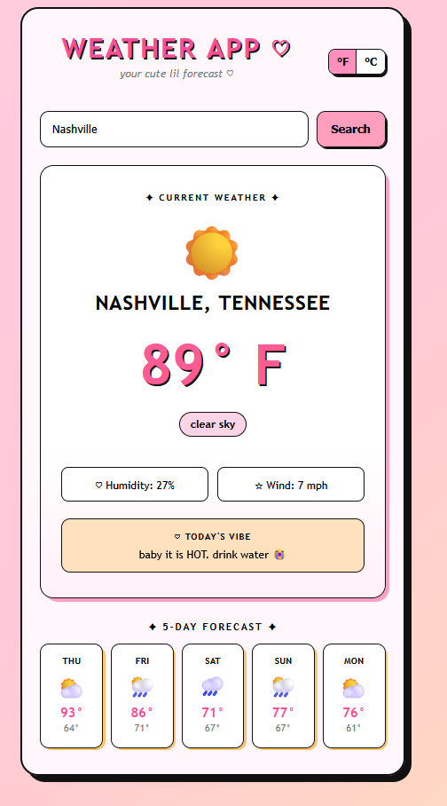

# Weather App ♡

A Y2K-inspired weather application built with HTML, CSS, and JavaScript.

## Live Demo

https://pretty-pink-poodle.github.io/weather-app/

## Preview

A cute, responsive weather app featuring dynamic themes, weather icons, and a custom forecast experience.

## Features

- Search weather by city
- Current weather conditions
- Five-day forecast
- Fahrenheit and Celsius toggle
- Feels-like temperature
- Humidity and wind speed
- Dynamic weather icons
- Weather-based color themes
- Custom weather messages
- Enter-key search
- Responsive mobile design

## Built With

- HTML5
- CSS3
- JavaScript
- Open-Meteo Weather API
- Open-Meteo Geocoding API
- Git
- GitHub
- GitHub Pages

## How It Works

The app uses the Open-Meteo Geocoding API to find the coordinates of a searched city.

Those coordinates are then used with the Open-Meteo Weather API to retrieve current conditions and forecast data.

JavaScript processes the returned JSON data and updates the page dynamically.

## Skills Practiced

- API integration
- Fetch requests
- Async/await JavaScript
- JSON data handling
- DOM manipulation
- Event listeners
- Dynamic CSS classes
- Responsive UI design
- Git version control
- Website deployment

## Future Improvements

- Save favorite locations
- Automatic location detection
- Hourly forecast
- Weather alerts
- Loading animations
- Accessibility improvements

## Author

Lauren Surles